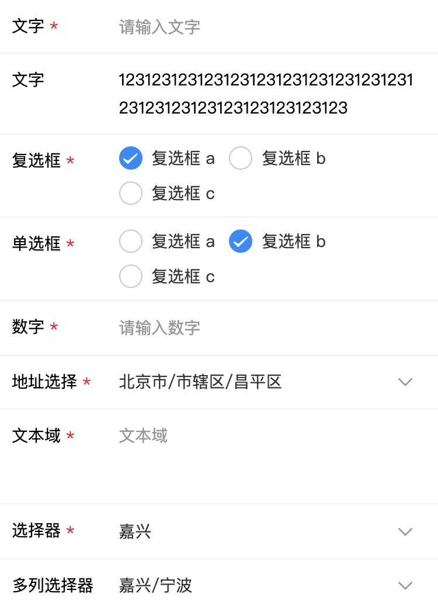

# 基于vant-ui表单封装的表单组件
* 目前已经集成的组件（Address/Checkbox/DatePicker/Input/Radio/Select/Text/Switch/Upload）
* 组件的调用方式采取 `JSON` 配置的形式，具体参数见model数据说明
* 校验规则已经集成 `VeeValidate` 插件，也可以自定义扩展规则，更多资料 [https://logaretm.github.io/vee-validate](https://logaretm.github.io/vee-validate)
* [在线演示](https://codesandbox.io/s/v-formshili-3hs2c)

## 语法约定
* mixin公用方法使用 `__` 作为前缀
* 事件传递使用 `e__` 作为前缀
* `@` 为组件校验规则保留关键字

## 安装
```bash
yarn add @xuanmo/v-form
```

## 使用

- js
```js
// 引入组件，推荐使用这种方式
import VForm from '@xuanmo/v-form'

// 不需要编译方式引入
// import VForm from "@xuanmo/v-form/dist/v-form.umd.js"
// import "@xuanmo/v-form/dist/v-form.css"

// 注册组件
Vue.use(VForm)

/**
 * 自定义校验规则示例，规则遵循VeeValidate规则扩展
 * 更多资料查看：https://logaretm.github.io/vee-validate/guide/basics.html#validation-provider
 */
Vue.use(VForm, {
  validator: {
    custom: {
      message: '长度不能大于{length}',
      // 此处定义的值可以在`validate`函数的第二个参数接收
      params: ['length'],
      validate: (value, { length }) => {
        return value.length <= length
      }
    },

    // 关联校验，可将多个表单项的值做比对
    target: {
      message: '关联校验失败',
      params: ['target1', 'target2'],
      validate: (value, { target1, target2 }) => {
        return value === target1 && value === target2
      }
    }
  }
})
```

- html
```html
<v-form :model="model"></v-form>
```

- `vue.config.js` 配置组件编译(注：如果组件引入采取的后编译需要配置这一项)
```js
module.exports = {
  transpileDependencies: [
    '@xuanmo/v-form'
  ]
}
```

## props

|字段名|说明|类型|默认值
|---|---|---|---|
|v-model(value)|获取组件处理完成的数据|object|{}|
|model|数据模型(具体类型参考后续文档)|array|{}|
|disabled|是否禁用表单|boolean|false|
|label-width|label宽度|string|20%|
|label-position|label对齐方式，可选：left/right|string|left|
|label-color|label文字颜色|string|-|
|show-label|是否显示label|boolean|true|
|validator|局部校验规则|object|{}|

## events

|事件名|说明|回调参数
|---|---|---|
|change|数据更改时触发|object{value,errorMsg,isValid}|
|event|数据发生改变所发送的事件|object{event,formModel}|

## slots
> 组件可接受多个slot，用于替换当前行的表单组件，会为该slot传入该组件的原始数据，每个slot的name为当前行的key，注：该slot不继承所有校验规则
```html
<!-- 示例如下 -->
<v-form :model="model">
  <template v-slot:text="{ data }">
    <van-field v-model="data.value"></van-field>
  </template>

  <!-- 行label自定义slot，格式{key}-label -->
  <template #text-label>
    自定义label
  </template>

  <!-- 行扩展字段slot，格式{key}-extra -->
  <template #text-extra>
    extra
  </template>
</v-form>
```

## model数据格式
> 以下是一个简单的数据格式，生成一个输入框，详细使用见目录example

```js
const model = [
  // 以下三个文字输入示例为关联校验
  // 关联校验采取{rule}:@{field},@{field}格式
  // 接收字段采取@{rule}格式
  {
    key: 'text1',
    value: '',
    rules: {
      label: '文字1',
      type: 'VInput',
      vRules: 'required|custom:@text2,@text3',
      placeholder: '请输入文字',
      errMsg: '请输入文字'
    }
  },

  {
    key: 'text2',
    value: '',
    rules: {
      label: '文字2',
      type: 'VInput',
      vRules: 'required|@custom',
      placeholder: '请输入文字',
      errMsg: '请输入文字'
    }
  },

  {
    key: 'text3',
    value: '',
    rules: {
      label: '文字3',
      type: 'VInput',
      vRules: 'required|@custom',
      placeholder: '请输入文字',
      errMsg: '请输入文字'
    }
  },

  // 时间选择器
  {
    key: 'date',
    value: Date.now(),
    rules: {
      label: '时间',
      // 共4种类型：datetime、year-month、date、time
      type: 'VDatePicker|datetime',
      // 数据格式处理：timestamp时间戳，其他用法参考：https://github.com/xuanmos/datejs
      valueFormat: 'yyyy-MM-dd'
    }
  },

  // 图片上传
  {
    key: 'file',
    // 用于显示列表
    value: [{ path: 'https://upyun.xuanmo.xin/test/20200418225229.png' }],
    rules: {
      label: '文件上传',
      type: 'VUpload',
      action: 'xxx',
      accept: 'image/png',
      multiple: true,
      name: 'file',
      headers: {},
      // 上传附加的数据
      data: {
        dir: 'test'
      },
      // 自定义配置项，用于指定url字段为某个属性值
      props: {
        url: 'path'
      }
    }
  }
]
```

## 组件发生change事件返回的数据
```json
{
  "value": {}, // 所有的数据经过处理后会以一个对象存放在这个字段
  "errorMsg": [], // 所有的校验失败的错误信息集合
  "isValid": false // 是否有通过所有的校验标识
}
```

## 示例图片


