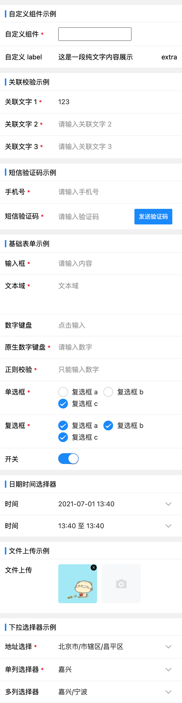

# 基于 Vant-UI 表单封装的动态表单组件

> Vue3 版动态表单 [https://github.com/D-xuanmo/dynamic-form](https://github.com/D-xuanmo/dynamic-form)

* 目前已经集成的组件（Address/Checkbox/DatePicker/Input/Radio/Select/Text/Switch/Upload）
* 组件不满足的情况可自定义开发组件或者使用 `slot` 的形式
* 组件的调用方式采取 `JSON` 配置的形式，具体参数见model数据说明
* 校验规则已经集成 `VeeValidate` 插件，也可以自定义扩展规则，更多资料 [https://logaretm.github.io/vee-validate](https://logaretm.github.io/vee-validate)
* [在线演示，可编辑](https://codesandbox.io/s/v-formshili-3hs2c)

## 语法约定
* `Mixin` 公用方法使用 `__` 作为前缀
* 事件传递使用 `e__` 作为前缀
* `@` 为组件校验规则保留关键字

## 本地运行本项目
```base
# 安装依赖
$ npm run bootstarp

# 启动项目
$ npm run dev
```

## 安装
```bash
# 推荐使用 yarn 安装，使用 npm 可能会存在依赖不全的情况
yarn add @xuanmo/v-form
```

## 使用

### 引入注册组件
```js
// 引入组件
import VForm from '@xuanmo/v-form'
import '@xuanmo/v-form/packages/style/index.less'

// 不经过编译引入方式，（不推荐）
// import VForm from '@xuanmo/v-form/dist/v-form.umd.min.js'
// import '@xuanmo/v-form/dist/index.css'

// 覆盖变量引入此文件替换变量即可，可参考 example/App.vue
// import '@xuanmo/v-form/packages/style/var.less'

// 注册组件
// 更多参数说明：https://github.com/D-xuanmo/v-form/blob/master/src/index.js#L6-L14
/**
 * 设置地址选择组件数据 JSON，组件默认不注册数据
 * 如果需要自定义数据，参考此文件结构即可
 */
import ADDRESS_JSON from '@xuanmo/v-form/packages/Address/data.json'
Vue.use(VForm, {
  addressJSON: ADDRESS_JSON
})

// 设置防抖时间，默认200ms
Vue.use(VForm, {
  debounceTime: 200
})
```

### 修改打包配置（注：如果组件引入采取的后编译需要配置这一项）
```js
// vue.config.js
module.exports = {
  transpileDependencies: [
    '@xuanmo/v-form'
  ]
}
```

### 修改数据模型配置
```js
Vue.use(VForm, {
  primaryData: true
})

// 默认的数据模型
const model1 = [
  {
    key: 'text1',
    value: '',
    rules: {
      label: '文字1',
      type: 'VInput',
      vRules: 'required|custom:@text2,@text3',
      placeholder: '请输入文字',
      errMsg: '请输入文字'
    }
  }
]

// primaryData 为 true 时的数据模型
const model2 = [
  {
    key: 'text1',
    value: '',
    label: '文字1',
    type: 'VInput',
    vRules: 'required|custom:@text2,@text3',
    placeholder: '请输入文字',
    errMsg: '请输入文字'
  }
]
```

### 注册全局自定义校验规则
```js
/**
 * 自定义校验规则示例，规则遵循VeeValidate规则扩展
 * 更多资料查看：https://logaretm.github.io/vee-validate/guide/basics.html#validation-provider
 */
Vue.use(VForm, {
  validator: {
    custom: {
      // 此处定义的值可以在`validate`函数的第二个参数接收
      params: ['length'],
      message: '长度不能大于{length}',
      validate: (value, { length }) => {
        return value.length <= length
      }
    },

    // 关联校验，可将多个表单项的值做比对
    target: {
      params: ['target1', 'target2'],
      message: '关联校验失败',
      // validate 第三个参数为正在执行校验相关联的组件实例
      validate: (value, { target1, target2 }, ctx) => {
        return value === target1 && value === target2
      }
    }
  }
})
```

### HTML
```html
<v-form v-model="value" :model="model"></v-form>
```

## 可用组件（所有的组件的属性都继承自Vant-UI属性，不包含上传文件组件）
|组件名|描述|
|---|---|
|VAddress|地址选择器|
|VCheckbox|复选框|
|VRadio|单选框|
|VInput|输入框|
|VNumberKeyboard|数字输入框|
|VVerificationCode|短信验证码|
|VDatePicker|时间选择器|
|VDatePickerRange|时间区间选择器|
|VSelect|下拉选择框|
|VSwitch|开关按钮|
|VText|纯文字展示|
|VUpload|文件上传|

### 关于自定义组件的使用（目前仅支持将该组件注册为全局组件使用）
> 在组件不能满足当前业务的需求时，可以使用 slot 或者自定义组件实现，slot 使用参考后续介绍

#### 制作组件，具体实现可参考 example/components/FormItemTest.vue
```js
// 导入公用组件的 Mixin
import { vFormItemBaseMixin } from '@xuanmo/v-form'
export default {
  name: 'FormItemTest',

  // 使用 Mixin
  mixins: [vFormItemBaseMixin],

  methods: {
    input(value) {
      // 此方法必须调用，否则组件将不能接收数据
      // 每次数据发生改变需要使用 e__input 方法对组件的数据进行上报
      this.e__input(value)

      // 如果需要发送自定义事件，可使用下边方法
      this.__eventHandler('input', value)
    }
  }
}
```

#### 全局注册组件
```js
import Vue from 'vue'
import FormItemTest from 'path'
Vue.component(FormItemTest.name, FormItemTest)
```

#### 使用组件
```js
const model = [
  {
    key: 'test',
    value: '',
    rules: {
      label: '自定义组件',
      // 传入组件名即可
      type: 'FormItemTest',
      placeholder: '点击输入',
      vRules: 'required',
      pattern: /^\d+$/,
      errorMsg: '自定义组件错误信息'
    }
  }
]
```

## Attributes
|字段名|说明|类型|默认值
|---|---|---|---|
|v-model(value)|获取组件处理完成的数据|object|{}|
|model|数据模型(具体类型参考后续文档)|array|[]|
|disabled|是否禁用表单|boolean|false|
|label-width|label宽度|string|20%|
|label-position|label对齐方式，可选：left/right|string|left|
|label-color|label文字颜色|string|-|
|show-label|是否显示label|boolean|true|
|validator|局部校验规则|object|{}|

## Methods
|方法|说明|参数
|---|---|---|
|validate|对整个表单执行校验|(callback: Function, ErrorList: []) => void|
|toggleFormItemVisible|切换表单单元的显示与隐藏状态|(key: string, visible: boolean) => void|
|setModelItemOptions|设置表单options，目前支持的组件：VAddress、VCheckbox、VRadio、VSelect|(key, data)接受两个参数，1. 数据key，2. data为一个数组或者 `() => <Promise>[]`|

## Events
|事件名|说明|回调参数
|---|---|---|
|change|数据更改时触发|object{value,errorMsg,isValid}|
|event|数据发生改变所发送的事件|object{event,formModel}|

## Slots
> 组件可接受多个slot，用于替换当前行的表单组件，会为该slot传入该组件的原始数据，每个slot的name为当前行的key，注：该slot不继承所有校验规则
```html
<!-- 示例如下 -->
<v-form :model="model">
  <template v-slot:text="{ data }">
    <van-field v-model="data.value"></van-field>
  </template>

  <!-- 行label自定义slot，格式{key}-label -->
  <template #text-label>
    自定义label
  </template>

  <!-- 行扩展字段slot，格式{key}-extra -->
  <template #text-extra>
    extra
  </template>
</v-form>
```

## model数据格式
> 以下是一个简单的数据格式，生成一个输入框，详细使用见目录example

```js
const model = [
  // 以下三个文字输入示例为关联校验
  // 关联校验采取{rule}:@{field},@{field}格式
  // 接收字段采取@{rule}格式
  {
    key: 'text1',
    value: '',
    rules: {
      label: '文字1',
      type: 'VInput',
      vRules: 'required|custom:@text2,@text3',
      placeholder: '请输入文字',
      errMsg: '请输入文字'
    }
  },

  {
    key: 'text2',
    value: '',
    rules: {
      label: '文字2',
      type: 'VInput',
      vRules: 'required|@custom',
      placeholder: '请输入文字',
      errMsg: '请输入文字'
    }
  },

  {
    key: 'text3',
    value: '',
    rules: {
      label: '文字3',
      type: 'VInput',
      vRules: 'required|@custom',
      placeholder: '请输入文字',
      errMsg: '请输入文字'
    }
  },

  // 时间选择器
  {
    key: 'date',
    value: Date.now(),
    rules: {
      label: '时间',
      // 共4种类型：datetime、year-month、date、time
      type: 'VDatePicker|datetime',
      // 数据格式处理：timestamp时间戳，其他用法参考：https://github.com/D-xuanmo/datejs
      valueFormat: 'yyyy-MM-dd'
    }
  },

  // 图片上传
  {
    key: 'file',
    // 用于显示列表
    value: [{ path: 'https://upyun.xuanmo.xin/test/20200418225229.png' }],
    rules: {
      label: '文件上传',
      type: 'VUpload',
      action: 'xxx',
      accept: 'image/png',
      multiple: true,
      name: 'file',
      headers: {},
      // 上传附加的数据
      data: {
        dir: 'test'
      },
      // 自定义配置项，用于指定url字段为某个属性值
      props: {
        url: 'path'
      }
    }
  }
]
```

## 组件 change 事件返回的数据
|字段名|说明|
|:---:|:---:|
|value|所有的数据经过处理后会以一个对象存放在这个字段|
|errorMsg|所有的校验失败的错误信息集合|
|isValid|是否有通过所有的校验标识|
```json
{
  "value": {},
  "errorMsg": [],
  "isValid": false
}
```

## 示例图片

